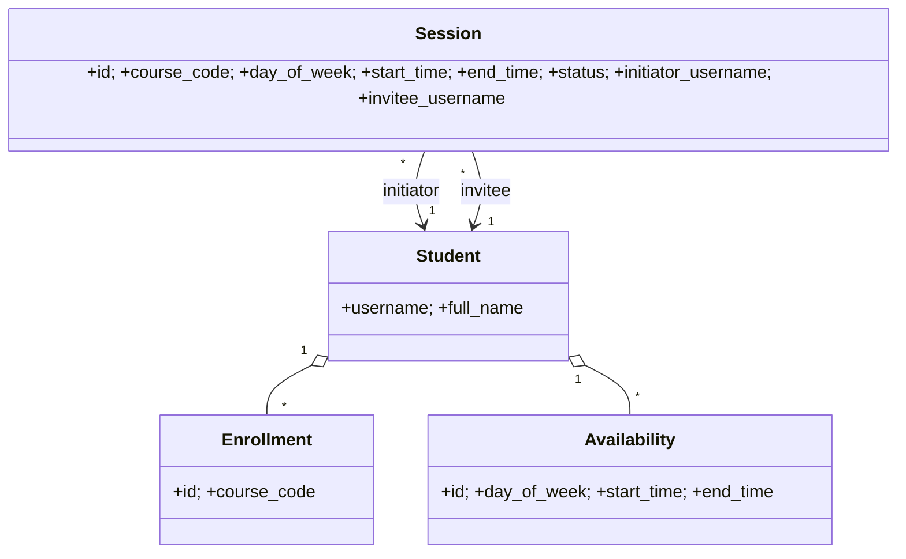

<p align="center">

# 🎓 Study Buddy — Menu App (Python + SQLite)


[](https://www.python.org/)
[](https://sqlite.org/)
[](#)

</p>

---

## ✨ What it does

* 👤 **Create profile** (unique username + full name)
* 📚 **Manage courses** (add/remove; no duplicates)
* 🗓️ **Manage availability** (weekly slots: day, start, end; `start < end`; no exact dups)
* 🔎 **Find classmates by course** (excludes yourself)
* 🤝 **Suggested matches** (shared course **and** ≥ 30-minute overlap)
* 📅 **Propose session** (must be **within** overlapping availability)
* ✅ **Confirm session** (invitee only; rejects overlap with existing **Confirmed** sessions)
* 🧾 **List sessions** (Proposed + Confirmed)

---

## 🚀 Quick Start

1. **Install Python 3.x** (no extra packages required; uses stdlib `sqlite3`).
2. Put `studybuddy.py` in a folder.
3. **Run**:

   ```bash
   python studybuddy.py
   ```


## 🧭 Menu Map

```
1) Switch / Log in as user
2) Create profile
3) View my profile & courses
4) Manage my courses
5) Manage my availability
6) Find classmates by course
7) See suggested matches
8) Propose a study session
9) Confirm my proposed sessions
10) List my sessions
0) Exit
```

---

## 📐 Data & Rules

* **Days:** `Mon Tue Wed Thu Fri Sat Sun` (also accepts full names like “Monday”)
* **Time format:** `"HH:MM"` 24-hour (e.g., `14:30`)
* **Availability:** must satisfy `start < end`; exact duplicates blocked
* **Courses:** duplicates blocked per user
* **Suggestions:** require shared course **and** ≥ 30-minute overlap
* **Propose session:** window must be **inside** an overlapping interval (≥ 30 min)
* **Confirm session:** invitee only; rejects overlaps with **existing Confirmed** sessions

---

## 🧪 Acceptance Checklist

* [ ] **AC-1:** duplicate username is rejected
* [ ] **AC-2:** availability with `start ≥ end` is rejected
* [ ] **AC-3:** classmates list excludes the active user and includes only enrollees
* [ ] **AC-4:** suggestions require shared course **and** ≥ 30-minute overlap
* [ ] **AC-5:** proposals outside overlap are rejected; valid ones saved as **Proposed**
* [ ] **AC-6:** confirming a session overlapping an existing **Confirmed** session is rejected

---

## 🔎 Quick Demo Script

1. Create two users (e.g., `tiger1`, `tiger2`).
2. Add the same course to both (e.g., `MATH 4000`).
3. Give both overlapping availability (e.g., `Mon 14:00–15:30`).
4. As `tiger1`, **See suggested matches** → should list `tiger2`.
5. **Propose** `Mon 14:30–15:00`.
6. Switch to `tiger2` → **Confirm my proposed sessions**.
7. **List my sessions** → status should be **Confirmed**.

---

## 🧩 Files

| File                                     | Purpose                                                          |
| ---------------------------------------- | ---------------------------------------------------------------- |
| `studybuddy.py`                          | Single-file app (menu UI + simple service layer + SQLite schema) |
| `studybuddy.db`                          | SQLite database (auto-created on first run)                      |

<details>
<summary><b>Data Model</b></summary>



</details>

---

## 🛠️ Troubleshooting

* **“username already exists”** → pick another (by design)
* **Invalid day/time** → use `Mon..Sun` and `HH:MM` 24-hour
* **No matches** → ensure **shared course** + **≥ 30-min** overlap
* **Confirm fails** → likely overlaps with an existing **Confirmed** session

---


